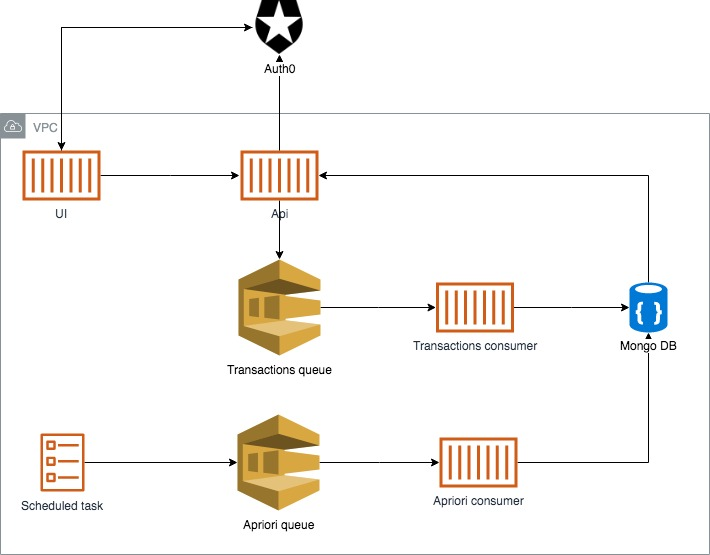

# Sommelier

* Mine frequent item sets and association rules. 
* Use the metrics `lift`, `leverage` and `conviction` to find the most interesting associations.
* Continually monitor your associations at recurring intervals.

## Requrirments 
* [Docker](https://www.docker.com/)
* [Leiningen](https://leiningen.org/)
* [Auth0](https://auth0.com/)

## Installation

### Local

```bash
// containerize
./gradlew containerize 

// start
./gradlew run

// run test suite
./gradlew cucumber
./gradlew cucumber -Dtag="@SmokeTest"
./gradlew cucumber -Dtag="@IntegrationTest"

// stop
./gradlew stop
```

### AWS

```bash
// start
./gradlew containerize publish deploy
```

## Design



## Usage
