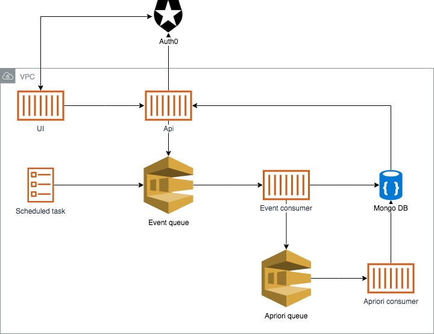

# Sommelier

## About
* Mine frequent item sets and association rules. 
* Use the metrics `lift`, `leverage` and `conviction` to find the most interesting associations.
* Continually monitor your associations at recurring intervals.
* Integrated with [Auth0](https://auth0.com/).

## Installation

### Local Development

You will first require [Docker](https://www.docker.com/) and [Leiningen](https://leiningen.org/) to be running on your local machine. 

Next, clone this repository and create a `auth.env` file locally in the project root. This will contain the `CLIENT_ID`, `CLIENT_SECRET` and `DOMAIN` of your Auth0 app. 
Documentation about how to create an Auth0 app can be found [here](https://auth0.com/docs/getting-started/set-up-app).
The contents of your `auth.env` file should look something like this: 
```text
CLIENT_ID=YOUR_AUTH0_CLIENT_ID
CLIENT_SECRET=YOUR_AUTH0_CLIENT_SECRET
DOMAIN=YOUR_AUTH0_DOMAIN
```

Now you can use `./gradlew` to run these tasks locally: 

```bash
// containerize
./gradlew containerize 

// start app
./gradlew run

// run test suite
./gradlew cucumber
./gradlew cucumber -Dtag="@SmokeTest"
./gradlew cucumber -Dtag="@IntegrationTest"

// stop app
./gradlew stop
```

If you would like to contribute to this project then please adhere to the rules [here](link).

### Docker (TBD)

All the modules for this project are built as docker images and published to docker hub.  

Modules: 
* [Api]()
* [Apriroi]() (sqs consumer)
* [Event]() (sqs consumer)
* [Scheduled Task]()

#### Docker compose (TBD)

Here is a `docker-compose` config which pulls down each module from docker hub and runs it locally. 

```yaml
version: "3"
services:
  api:
    image: sommelier/api:latest
    command: run
    depends_on:
      - localstack
    networks:
      - sommelier
    ports:
    - 3000:3000
    env_file:
    - auth.env
    restart: on-failure:3

  apriori:
    image: sommelier/apriori:latest
    command: run
    depends_on:
      - localstack
    networks:
      - sommelier
    environment:
      - AWS_ACCESS_KEY_ID=111
      - AWS_SECRET_ACCESS_KEY=111
      - AWS_REGION=us-east-1
    restart: on-failure:3

  mongo:
    image: mongo:latest
    networks:
      - sommelier
    restart: on-failure:3
    ports:
      - 27017:27017
    environment:
      - MONGODB_USERNAME=sommelier
      - MONGODB_PASSWORD=abc123
      - MONGODB_DATABASE=sommelier
      - MONGODB_ROOT_PASSWORD=abc123

  mongo-express:
    image: mongo-express:latest
    networks:
      - sommelier
    depends_on:
      - mongo
    restart: on-failure:3
    ports:
      - 8081:8081
    environment:
      - ME_CONFIG_MONGODB_ADMINUSERNAME=admin
      - ME_CONFIG_MONGODB_ADMINPASSWORD=abc123

  localstack:
    image: localstack/localstack:latest
    networks:
      - sommelier
    ports:
      - "4567-4584:4567-4584"
      - "${PORT_WEB_UI-8080}:${PORT_WEB_UI-8080}"
    environment:
      - AWS_REGION=us-east-1
      - SERVICES=sqs
    restart: on-failure:3

networks:
  sommelier:
    driver: bridge
```

In this example, we also retrieve the [localstack](https://github.com/localstack/localstack) image. 
This allows us to mimike aws locally.
Therefore, after running `docker-compose up` make sure you create the `sommelier-aprior` and `sommelier-event` quese's in localstack. 
To do so, run the following commands: 

```bash 
aws --endpoint-url=http://localhost:4576 --region=us-east-1 sqs create-queue --queue-name "sommelier-apriori"
aws --endpoint-url=http://localhost:4576 --region=us-east-1 sqs create-queue --queue-name "sommelier-event"
```

### AWS (TBD)
We are using `terraform` to deploy this application to `aws`. Therefore, make sure you have created your AWS credentials file. The default location for this file is `$HOME/.aws/credentials` on Linux and OS X, or `"%USERPROFILE%\.aws\credentials"` for Windows users.
The contents of your AWS credentials file should look something like this: 
```text
[default]
aws_access_key_id = {your_aws_access_key_id}
aws_secret_access_key = {your_aws_secret_access_key}
```

Next, create a new `prod.tf` file in `infastrucutre/environements/prod/`. 
You can take a look at `infastrucutre/environements/example/example.tf` to see what the contents of this file should be. 
Note that you need to set your own: `subnet_ids` and `security_groups`. 

Finally, run the following `gradlew` task to deploy the latest docker images to your aws account. 

```bash
// deploy
./gradlew deploy
```

#### Design



## Usage

### Auth0

Execute this code snippet to request a token, use your own `CLIENT_ID`, `CLIENT_SECRET` and `API_IDENTIFIER` as shown in Auth0. 

```bash
curl --request POST \
  --url 'https://YOUR_DOMAIN/oauth/token' \
  --header 'content-type: application/x-www-form-urlencoded' \
  --data grant_type=client_credentials \
  --data 'client_id=YOUR_CLIENT_ID' \
  --data client_secret=YOUR_CLIENT_SECRET \
  --data audience=YOUR_API_IDENTIFIER
```

### Api

A swagger doc can be found at `http://localhost:3000/docs`

## Software development kits (SDK)
TBD


